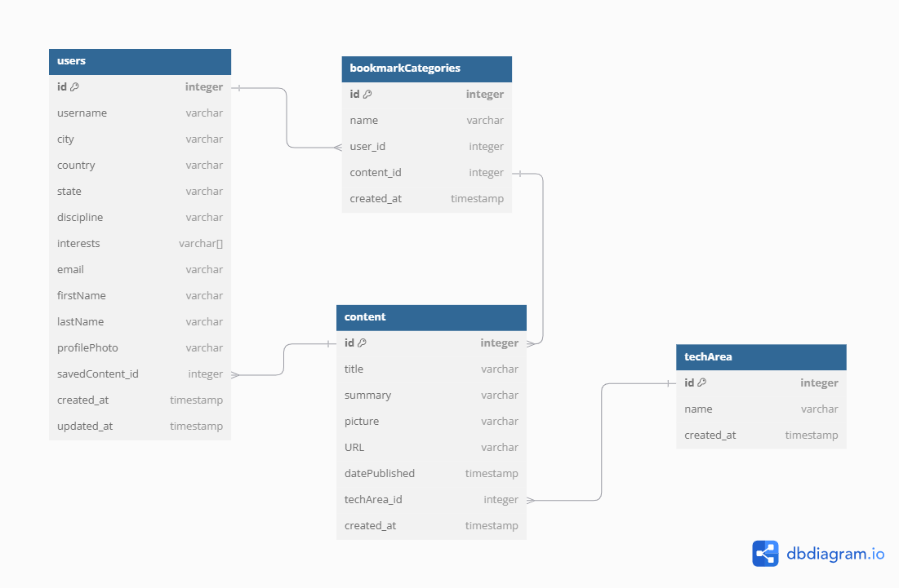

# LAP6_innotrack

- [Overview](#overview)
    - [Problem](#problem-to-solve)
    - [Target Market](#target-market)
    - [Value Proposition](#value-proposition)
- [Implementation](#implementation)
    - [Tech Stack](#tech-stack)
    - [Value Proposition](#value-proposition)
- [Installation](#installation)

## Overview
InnoTrack is a collaborative space feature integrated into an existing platform. This feature will:
- Deliver a concise, curated feed of industry updates (5-7 pieces) categorized into key tech areas (e.g., Software Development, Data Science, AI).
- Offer optional interest-based personalization during onboarding to tailor the content feed.
- Provide a bookmarking option to save content.
- Provide a goal setting option personalized for each user.

### Problem to Solve
New tech graduates or career-transitioners often struggle to stay updated with the most relevant, curated, high-quality industry content amidst an overwhelming amount of information.

### Target Market
1. New tech graduates and early career professionals transitioning into tech roles
2. Aspiring developers or tech enthusiasts

### Value Proposition
1. Relevance: curated and concise content 
2. Convenience: interest-based personalization
3. Retention: bookmarking builds personal library
4. Support: structure system foster engagement

## Implementation

### Tech Stack
- [Firebase](https://firebase.google.com/)
- [ShadCN](https://ui.shadcn.com/)
- [React](https://react.dev/)

### Others
- [Vite](https://vite.dev/)
- [SASS](https://sass-lang.com/)

### Mockups

### ERD

## Installation
1. run `npm install` to install dependencies
2. run `npm run dev`